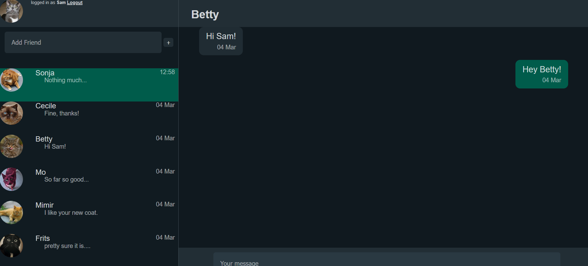

# Chat app with Django Channels
A single-page chat application modeled after WhatsApp Web. 

### How to use
1. Register users
2. Login
3. Add friend by username
4. Click friend to open chat

### Requirements
Django Channels
python -m pip install -U 'channels[daphne]'

### Technologies
- Python Django
- Django Channels
- Javascript

